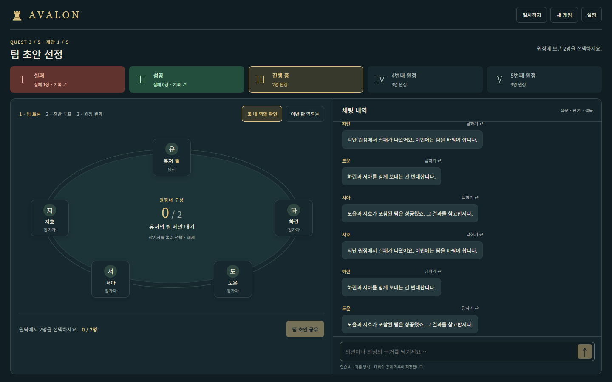

# Avalon AI

**사람 1명과 AI 4명이 함께 플레이하는 5인 아발론 웹 게임입니다.**

자신의 역할을 확인하고 AI와 대화하며 원정대를 구성하고 투표합니다. 선은 원정 성공을, 악은 원정 실패 또는 멀린 암살을 목표로 합니다. AI마다 허용된 정보가 다르며, 게임 규칙과 비밀 정보의 경계는 서버가 관리합니다.

현재 멀린·충신·암살자·악의 하수인으로 구성된 5인 게임을 지원합니다. 7인 확장과 추가 역할의 실제 배정·게임 규칙은 후속 계획입니다.



*합성 게임 상태로 검사한 화면입니다. 실제 모델 플레이나 품질 평가 결과를 나타내지 않습니다.*

[배포 사이트](https://avalon-ai-game.sooyeon-jun-0389.chatgpt.site/) · [제품 요구사항](docs/avalon-PRD.md) · [설계·검증 기록](작업일지.md)

배포 사이트는 최근 확인 기준 소유자 전용 비공개입니다. GitHub 소스를 보는 것과 서비스에 접속하는 권한은 별개입니다.

## 만드는 이유

같은 공개 사건을 보고도 역할과 시작 정보에 따라 다른 판단을 하는 AI를 상대로 한 판을 플레이할 수 있는 환경을 만듭니다. 규칙에 맞는 진행과 비밀 정보 보호를 먼저 검증하고, 대화·기만·행동의 일관성은 실제 플레이와 별도 평가로 확인합니다.

현재 개인 프로젝트로 개발 중입니다. 모델을 연결하거나 자동 테스트를 통과했다는 사실만으로 자연스러운 토론과 전략 품질을 달성했다고 보지 않습니다.

## 게임에서 할 수 있는 일

| 기능 | 현재 구현 |
| --- | --- |
| 원탁과 행동 중심 화면 | 참가자 선택으로 팀 구성, 찬반 투표·임무 카드·암살, 별도 채팅 내역 |
| 역할 안내 | **내 역할 확인**으로 최초 안내 다시 열기, **이번 판 역할들**에서 공개 역할 종류·인원수·규칙 확인 |
| 역할별 비밀 정보 | 멀린은 악의 정체, 악은 동료, 충신은 자신의 역할을 알고 시작 |
| 결과와 과거 기록 | 성공·실패 색상 구분, 원정 클릭 시 당시 리더·팀·공개 투표·실패 카드 수 확인 |
| 사람이 정하는 진행 | 팀 초안 공유 → 토론·수정 → 투표 시작 → 결과 확인 후 다음 단계 |
| 종료 전 역할 추측 | 세 번째 성공 또는 실패 원정 뒤 AI 4명의 역할 추측, 최종 종료 후 정답과 점수 공개 |
| 모바일 | 참가자 한 줄 배치와 아래 채팅, 화면 크기에 맞는 행동·안내 팝업 |
| 기록과 비용 | 판별 사용량·추정 비용 확인, 종료 로그 JSON 다운로드, 모델 구성별 비교 |

암살자는 원정이 세 번 성공한 뒤 멀린을 지목해 승부를 뒤집을 수 있습니다. 역할 안내에는 승리 조건·능력·개인 시작 정보·원정 선택을 함께 표시합니다. 퍼시벌·모르가나·모드레드·오베론의 설명과 조건부 예외 문구도 준비했지만, 해당 역할의 게임 엔진을 구현한 것은 아닙니다.

## Gemini와 JEV의 역할

**설정 → AI 비교 모드**에서 선택한 구성은 다음 새 게임부터 적용됩니다. 연결이 준비된 환경에서는 `JEV + Gemini`가 기본이며, 발언자·행동 선택을 따로 지정하는 사용자 설정도 제공합니다.

| 구분 | Gemini 단독 | JEV + Gemini |
| --- | --- | --- |
| 대화 생성 | Gemini | Gemini |
| 발언 필요성·발언자 선택 | 기존 코드 규칙 | 공개 맥락을 받은 JEV가 각각 판단 |
| 팀 제안·투표·악의 카드·암살 선택 | Gemini | 개인 관찰값을 받은 JEV |
| 규칙·차례·합법성·승패 판정 | 서버 코드 | 서버 코드 |

JEV가 선택하는 합법 후보는 코드가 만듭니다. 선의 성공 카드처럼 선택지가 하나인 경우에는 코드로 확정할 수 있습니다. 키 없는 로컬 환경의 **연습 AI**, 정해진 안내 발언, 실패 시 기본 행동은 실제 모델 판단과 구분합니다.

### 정보와 기억의 경계

- 플레이어 AI에는 최근 공개 채팅 20개, 공개 사건과 결과, 자신의 역할·허용된 시작 정보·본인 카드와 행동 이력·직전 생각을 제공합니다. 다른 AI의 비밀 생각이나 미공개 표·카드를 공유하지 않습니다.
- 공개 발언자를 고르는 진행자 입력과 개인 행동 선택 입력을 분리합니다. 진행자에게 전체 역할표나 개인 생각을 주지 않습니다.
- JSON의 `thinking`은 모델이 생성한 자기보고 텍스트로 저장하고 다음 본인 요청의 기억으로 사용합니다. 모델 내부 추론 과정이 검증된 기록을 뜻하지 않습니다.
- JEV는 선택·확률 분포·확신도 등을 기록하며 Gemini와 같은 `thinking`을 생성한 것으로 취급하지 않습니다. 실제 선택은 이후 본인의 Gemini 대화 입력에 전달합니다.


## 두 구성을 비교하는 방법

1. 설정에서 모드를 선택하고 **새 게임**을 시작합니다.
2. 게임 종료 후 로그를 내려받습니다. 다른 모드도 번갈아 플레이하며 로그를 수집합니다.
3. 저장소 최상위에서 다음 명령을 실행합니다.

```powershell
node scripts/compare-models.mjs <Gemini로그.json> <혼합로그.json>
```

여러 로그를 추가 인자로 전달할 수 있습니다. 출력에는 모드별·조건별 완료 판 수, 선악 승패, 평균 추정 비용, 호출 수·지연, 오류·대체 처리, 역할 추측 정답률이 포함됩니다.

재시작·연습·사용자 조합·비교 버전이 기록되지 않은 과거 판은 완료 통계에서 제외합니다. 비용 평균에는 사용량 비용이 모두 확인된 판만 포함하며, 추측 점수는 제출한 판만 집계합니다. 같은 게임을 중복 입력하면 한 번만 집계하고 서로 다른 사본은 거부합니다.

사용자 역할과 모델·프롬프트 등 조건별 표본수를 함께 확인해야 합니다. 호출 지연은 사용자 체감 대기 시간이 아니며, 역할 추측 정답률이나 선의 승률이 높다고 AI 전체 품질이 좋다는 뜻도 아닙니다. **실제 Gemini 단독 대비 혼합 구성의 품질·비용 우열은 아직 검증하지 않았습니다.** [비교 설계와 한계](docs/specs/024-model-comparison.md)

## 구조와 기술

```text
브라우저: 원탁 · 채팅 · 행동 입력 · 역할/결과 팝업
    ↓ 사람 행동 / AI 진행 요청
게임 API: 상태 버전 확인 · AI 요청 잠금 · 검증 · 저장
    ├─ 규칙 엔진: 상태 전이 · 승패 · 플레이어별 관찰값
    ├─ Gemini: 대화·자기보고 생각 / 단독 모드의 행동
    ├─ JEV: 공개 발언 필요성·발언자 / 혼합 모드의 개인 행동 선택
    └─ D1: 게임 상태 · 사건 · 실패 · 호출 사용량
```

- **UI:** React, TypeScript, Tailwind CSS, Radix 기반 팝업·선택 컴포넌트
- **실행:** Next.js App Router 형식의 소스를 Vinext/Vite로 빌드, Cloudflare Workers에서 실행
- **저장:** D1, Drizzle
- **모델:** Gemini 직접 API 또는 Vertex 중계, JEV의 Choice API
- **검증:** Node.js 테스트 러너, TypeScript, 로컬 API 시나리오와 Playwright 화면 검사
- **배포:** Sites

모델 출력도 엔진의 차례·대상·규칙 검사를 통과해야 반영됩니다. 상태가 바뀌면 오래된 응답을 거부하고, 요청 잠금으로 중복 AI 실행을 제어합니다. 오류 시 제한된 재시도와 기본 행동을 사용하며 실패·대체 여부를 기록합니다.

호출별 모델·버전·토큰·추정 비용·지연·오류와 JEV 선택 기록을 남깁니다. 이것은 완전한 분산 추적 시스템이나 운영 대시보드를 구축했다는 의미는 아닙니다. [관측 설계](docs/observability.md)

## 로컬 실행

Node.js **22.13.0 이상**이 필요합니다. PowerShell에서 저장소 최상위를 기준으로 실행합니다.

```powershell
cd site
npm run install:ci
npm run build

# 새 로컬 DB에서 순서대로 1회 적용합니다.
node --import ./scripts/sites-env.mjs ./node_modules/wrangler/bin/wrangler.js d1 execute DB --local --config dist/server/wrangler.json --persist-to .wrangler/state --file drizzle/0000_abandoned_shadow_king.sql
node --import ./scripts/sites-env.mjs ./node_modules/wrangler/bin/wrangler.js d1 execute DB --local --config dist/server/wrangler.json --persist-to .wrangler/state --file drizzle/0001_burly_dracula.sql
node --import ./scripts/sites-env.mjs ./node_modules/wrangler/bin/wrangler.js d1 execute DB --local --config dist/server/wrangler.json --persist-to .wrangler/state --file drizzle/0002_conversation_usage.sql

npm start
```

터미널에 표시된 주소로 접속합니다. 이미 적용한 마이그레이션은 다시 실행하지 않습니다. 개발 화면은 `npm run dev`로 실행하며 로컬 DB 상태를 공유합니다. 빌드·실행 도구의 상세는 [스타터 실행 문서](site/README.md)를 참고하세요.

키 없이 연습 모드를 사용할 수 있습니다. 실제 Gemini 연결에는 `GEMINI_API_KEY` 또는 `VERTEX_PROXY_URL`·`VERTEX_PROXY_TOKEN`이 필요하며, JEV 혼합 구성에는 `TYPESAFE_API_KEY`도 필요합니다. 키·토큰은 로컬 비밀 설정이나 배포 환경 변수로 관리하고 Git에 포함하지 않습니다.

## 검증과 남은 과제

저장소 최상위에서 외부 모델 호출 없이 기본 검사를 실행합니다.

```powershell
node --test site/tests/*.test.mjs scripts/*.test.mjs
node site/node_modules/typescript/bin/tsc -p site/tsconfig.json --noEmit --incremental false
```

규칙·비밀 정보 경계·모델 출력과 실패 처리·모드 분리·역할 추측 채점·비교 집계를 검사합니다. `api-*.mjs`는 로컬 서버/DB 등 준비 조건이 필요하고, `ui-*.mjs`는 Playwright와 브라우저를 이용해 합성 API 상태로 화면을 검사합니다. `live-*.mjs` 및 `model-probe.mjs` 같은 실제 모델 평가는 기본 명령에 포함하지 않습니다.

모델 비교 기능 추가 시 로컬 게임 테스트 108개와 TypeScript·Worker 빌드, PC/모바일 UI·로컬 API·합성 로그 CLI 검사를 통과했습니다. 이는 해당 시점의 검증 기록이며 최신 변경별 명령·결과는 [작업일지](작업일지.md)에 남깁니다.

남은 과제는 실제 대화의 자연스러움과 밀도, 발언·행동의 일관성, 역할을 숨기는 전략 평가입니다. 과거 대화 후보 평가에는 기준 미달 사례도 있습니다. [대화 개선 평가 기록](docs/specs/009-concrete-discussion.md)을 보존하며, 자동 검사 통과를 실제 모델 품질 개선으로 표현하지 않습니다. 7인 확장은 별도 규칙·정보 경계 검증이 필요합니다.

## 코드와 문서 탐색

| 경로 | 내용 |
| --- | --- |
| [게임 화면](site/app/page.tsx) | 원탁·채팅·역할/결과 안내·모드 선택 |
| [게임 API](site/app/api/game/route.ts) · [규칙 엔진](site/lib/game.mjs) | 저장·상태 버전·차례·승패·관찰값 |
| [AI 요청](site/lib/ai.mjs) · [V3 프롬프트](site/lib/prompts/v3.mjs) | Gemini 요청·검증·개인 맥락 구성 |
| [진행자 선택](site/lib/discussion-routing.mjs) · [행동 선택](site/lib/action-selection.mjs) | JEV 입력 경계와 합법 후보 |
| [역할 설명](site/lib/role-guide.mjs) · [역할 추측](site/lib/role-guess.mjs) | 개인/공개 안내와 종료 전 추측·채점 |
| [호출 기록](site/lib/usage.mjs) · [종료 로그](site/lib/game-log.mjs) | 사용량·비용·사건 내보내기 |
| [모드 비교](site/lib/comparison.mjs) · [비교 CLI](scripts/compare-models.mjs) | 프리셋과 로그 집계 |
| [제품 요구사항](docs/avalon-PRD.md) · [기능별 설계](docs/specs/) | 범위·설계·검증 기준 |
| [작업일지](작업일지.md) | 사용자 판단과 실제 구현·검사·배포 근거 |

키·토큰·로컬 DB·실제 게임 원문 로그는 공개 대상에서 제외합니다. 종료 로그에는 대화·정체·개별 카드·모델 자기보고 생각이 포함되므로 그대로 저장소에 올리지 않습니다. 화면 검증 자료의 합성 상태와 실제 플레이 기록을 구분합니다.

설계 문서에는 작성 당시 상태나 미구현 제안도 포함됩니다. 현재 구현은 코드와 작업일지의 최근 기록을 함께 확인하세요.
